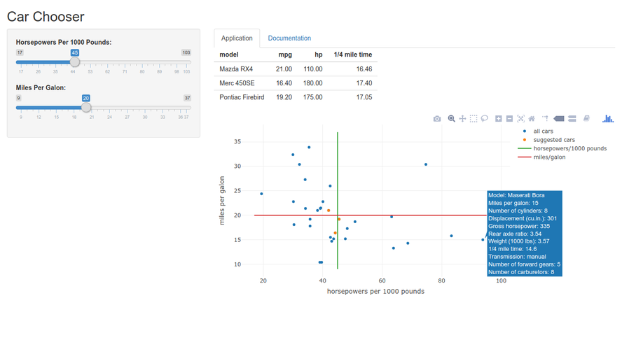

### Overview

It is a supportive presentation for 'Car Chooser' project which is intended to
be used for helping in choosing the car procedure based on two characteristics:

* horsepowers per 1000 pounds
* miles per galon

For demonstration purposes considering application is based on *mtcars* dataset
from 'data' library

```{r}
summary(mtcars[, c("mpg", "hp", "wt", "qsec")])
```

### Exploratory Analysis

Since application is using dependency between 'miles per galon' and 'horsepowers
per 1000 pounds', the following chart contains prediction results based on
linear regression model for this dependency:

```{r, echo = FALSE}
mt_cars <- mtcars
mt_cars$hpp <- mt_cars$hp / mt_cars$wt
plot(mt_cars$hpp, mt_cars$mpg,
     xlab = "horsepowers per 1000 pounds", ylab = "miles per galon")
abline(lm(mpg ~ hpp, data = mt_cars))
```

### Application Interface



### Executive Summary

This application was developed during the coursera.org "Developing Data
Products" course project assignment (Johns Hopkins University).

It is possible to find considered application on www.shinyapps.io.

Thanks for attention.